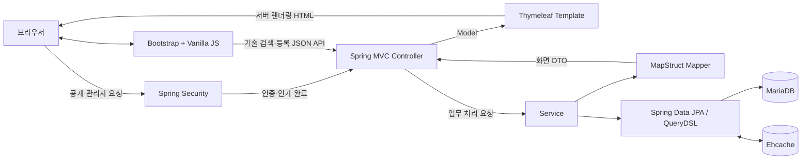
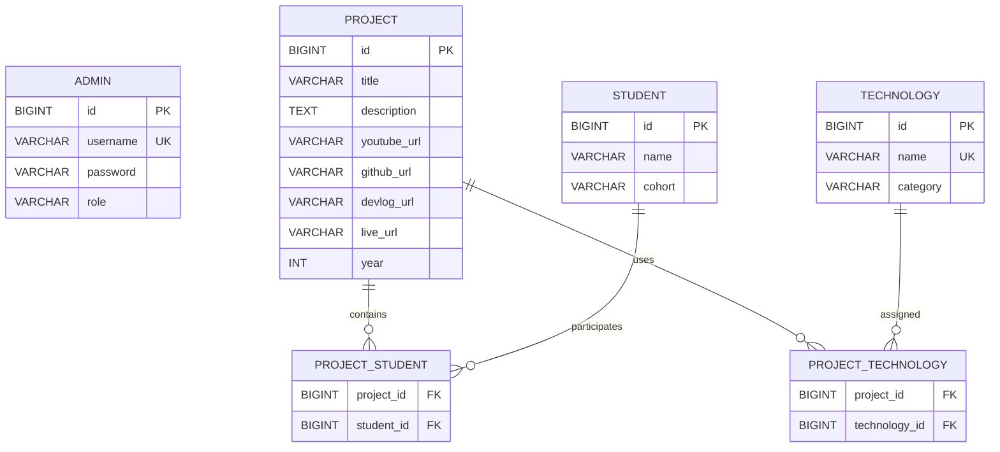
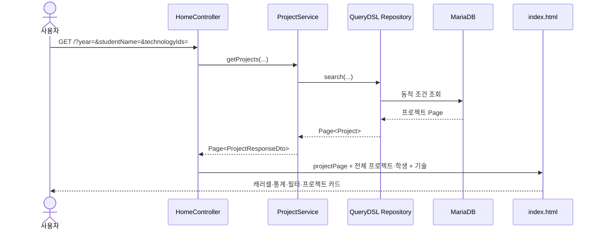
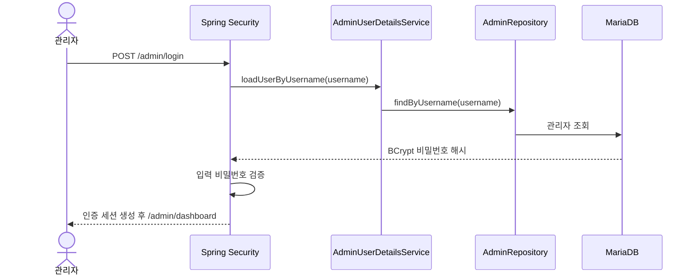

# SW Project Portal

한국폴리텍대학 서울강서캠퍼스 SW 작품전의 프로젝트를 전시하고, 관리자가 프로젝트·학생·기술 정보를 관리할 수 있도록 만든 Spring Boot 기반 포털입니다.

프론트엔드는 React 없이 **Thymeleaf 서버 렌더링 + Bootstrap 5 + Vanilla JavaScript**로 구성되며, 프로젝트와 학생 정보는 MariaDB에서 조회합니다.

## 주요 기능

- 등록 프로젝트를 이용한 동적 캐러셀과 프로젝트 카드 목록
- 등록 프로젝트 수와 참여 학생 수의 동적 표시
- 연도, 학생 이름, AI 사용 여부, 기술을 이용한 프로젝트 검색
- 프로젝트별 YouTube 영상 미리보기와 상세 페이지
- 카테고리별 기술 스택 및 선택적으로 등록된 외부 링크 표시
- Spring Security 세션 기반 관리자 로그인
- 관리자 프로젝트·학생 CRUD
- 프로젝트 폼의 기술 검색, 신규 기술 등록 및 태그 입력
- 프로젝트 목록 페이지네이션

## 기술 스택

| 구분 | 기술 | 용도 |
|---|---|---|
| 언어 | Java 17 | 백엔드 애플리케이션 |
| 프레임워크 | Spring Boot 4.1.0 | 애플리케이션 구성과 실행 |
| 웹 | Spring Web MVC | Controller와 HTTP 요청 처리 |
| 템플릿 | Thymeleaf | DB 데이터를 HTML로 서버 렌더링 |
| 인증 | Spring Security, BCrypt | 관리자 인증, 세션, 경로 보호, 비밀번호 해시 |
| 데이터 | Spring Data JPA, Hibernate | 엔티티 매핑과 CRUD |
| 데이터베이스 | MariaDB | 프로젝트, 학생, 기술, 관리자 데이터 저장 |
| 검색 | QueryDSL 5.1 | 다중 조건 동적 검색과 페이지네이션 |
| 매핑 | MapStruct 1.6.2 | 엔티티를 화면용 DTO로 변환 |
| 캐시 | Ehcache 3, Hibernate JCache | Technology 엔티티 2차 캐시 |
| 코드 간소화 | Lombok | 생성자, Getter, Builder 생성 |
| UI | Bootstrap 5.3.3 | 캐러셀, 모달, 폼, 반응형 레이아웃 |
| 브라우저 로직 | Vanilla JavaScript | 공통 헤더, 영상 모달, 필터, 기술 태그 입력 |
| 빌드 | Gradle Wrapper 9.5.1 | 의존성, 컴파일, 테스트, 실행 |
| 테스트 | JUnit 5, Spring Boot Test | Spring ApplicationContext 실행 확인 |

> `DataSeeder`에 React 기술 데이터가 포함되어 있지만, 이는 전시 프로젝트의 기술 스택 예시입니다. 포털 프론트엔드 자체는 React를 사용하지 않습니다.

## 시스템 아키텍처



애플리케이션은 별도의 프론트엔드 서버를 사용하지 않습니다. Spring Boot가 Thymeleaf HTML과 `/css`, `/js`, `/images` 정적 리소스를 함께 제공합니다.

## 디렉터리 구조

```text
sw-project-portal/
├─ gradle/wrapper/                         Gradle Wrapper
├─ src/
│  ├─ main/
│  │  ├─ java/kopo/swprojectportal/
│  │  │  ├─ config/                       보안·QueryDSL·초기 데이터 설정
│  │  │  ├─ controller/                   공개 및 관리자 URL 매핑
│  │  │  ├─ dto/                          화면·폼 전송 객체
│  │  │  ├─ entity/                       JPA 엔티티
│  │  │  ├─ mapper/                       Entity → DTO 변환
│  │  │  ├─ repository/
│  │  │  │  └─ impl/                      QueryDSL 검색 구현
│  │  │  ├─ security/                     관리자 계정 조회
│  │  │  ├─ service/
│  │  │  │  └─ impl/                      업무 로직 구현
│  │  │  ├─ util/                         YouTube URL 처리
│  │  │  └─ SwProjectPortalApplication.java
│  │  └─ resources/
│  │     ├─ static/
│  │     │  ├─ css/                       공통·페이지별 스타일
│  │     │  ├─ images/                    Open Graph 이미지
│  │     │  └─ js/                        공통·페이지별 브라우저 로직
│  │     ├─ templates/
│  │     │  ├─ admin/                     관리자 템플릿
│  │     │  ├─ index.html                 공개 목록
│  │     │  └─ project-detail.html        프로젝트 상세
│  │     ├─ application.yml               애플리케이션 설정
│  │     └─ ehcache.xml                   Technology 캐시 설정
│  └─ test/
│     └─ java/kopo/swprojectportal/
│        └─ SwProjectPortalApplicationTests.java
├─ .gitattributes
├─ .gitignore
├─ build.gradle
├─ gradlew
├─ gradlew.bat
└─ settings.gradle
```

`.gradle/`, `build/`, `bin/`은 빌드나 IDE가 생성하는 결과물이며 실제 소스가 아닙니다.

## 백엔드 패키지

### 진입점과 설정

| 파일 | 역할 |
|---|---|
| [`SwProjectPortalApplication.java`](src/main/java/kopo/swprojectportal/SwProjectPortalApplication.java) | Spring Boot 실행 진입점 |
| [`SecurityConfig.java`](src/main/java/kopo/swprojectportal/config/SecurityConfig.java) | `/admin/**` 보호, 로그인·로그아웃, BCrypt 설정 |
| [`QuerydslConfig.java`](src/main/java/kopo/swprojectportal/config/QuerydslConfig.java) | `JPAQueryFactory` Bean 등록 |
| [`AdminSeeder.java`](src/main/java/kopo/swprojectportal/config/AdminSeeder.java) | 관리자 테이블이 비었을 때 초기 관리자 생성 |
| [`DataSeeder.java`](src/main/java/kopo/swprojectportal/config/DataSeeder.java) | 프로젝트가 없을 때 예시 기술·학생·프로젝트 생성 |

### Controller

| Controller | 주요 경로 | 역할 |
|---|---|---|
| `HomeController` | `GET /` | 목록 검색, 통계, 캐러셀, 기술 필터 모델 구성 |
| `ProjectController` | `GET /project/{id}` | 프로젝트 상세 조회 |
| `AdminController` | `/admin/login`, `/admin/dashboard` | 로그인·대시보드 템플릿 반환 |
| `ProjectAdminController` | `/admin/projects/**` | 프로젝트 목록·등록·수정·삭제 |
| `StudentAdminController` | `/admin/students/**` | 학생 목록·등록·수정·삭제 |
| `TechnologyController` | `/admin/api/technologies/**` | 기술 검색과 신규 기술 등록 JSON API |

### Service

- `ProjectService`: 프로젝트 검색, 상세 조회, 등록, 수정, 삭제
- `StudentService`: 학생 조회, 등록, 수정, 삭제
- `TechnologyService`: 기술 분류 조회, 이름 검색, 중복 방지 등록
- `service/impl`: 트랜잭션 경계와 실제 업무 로직

조회 메서드는 기본적으로 `@Transactional(readOnly = true)`, 데이터 변경 메서드는 `@Transactional`로 실행됩니다.

### Repository

- `AdminRepository`: 사용자명으로 관리자 조회
- `ProjectRepository`: 프로젝트 기본 CRUD와 사용자 정의 검색 연결
- `ProjectRepositoryCustom`: 동적 검색 계약
- `ProjectRepositoryImpl`: QueryDSL 검색 구현
- `StudentRepository`: 학생 CRUD
- `TechnologyRepository`: 기술 이름 검색과 대소문자 무시 중복 조회

프로젝트 검색은 다음 조건을 동적으로 결합합니다.

- 연도
- 학생 이름
- AI 카테고리 기술 사용 여부
- 선택한 기술 ID
- 페이지 번호와 크기

복수 기술 선택은 선택된 기술 중 하나 이상을 사용하는 프로젝트를 찾는 OR 방식입니다.

### Entity와 DTO

- `Admin`: 관리자 사용자명, BCrypt 비밀번호, 역할
- `Project`: 프로젝트 기본 정보, YouTube URL, 선택 외부 링크, 연도
- `Student`: 학생 이름과 소속 기수
- `Technology`: 기술 이름과 카테고리
- `TechnologyCategory`: 기술 분류 Enum
- `ProjectResponseDto`: 목록·캐러셀 출력
- `ProjectDetailDto`: 상세·수정 화면 출력
- `ProjectFormRequestDto`: 프로젝트 등록·수정 입력
- `StudentFormDto`, `StudentOptionDto`: 학생 폼과 선택 항목
- `TechnologyOptionDto`: 기술 태그와 API 응답

### Mapper와 Utility

`ProjectMapper`는 MapStruct를 이용해 `Project` 엔티티를 목록·상세 DTO로 변환합니다. 학생 이름, 기술 이름, 기술 카테고리, AI 사용 여부도 함께 계산합니다.

`YoutubeUtils`는 YouTube URL에서 영상 ID를 추출해 썸네일 URL과 iframe 임베드 URL을 생성합니다.

## 데이터 모델



`Project`가 학생 및 기술 관계의 소유 측이며, 각각 `project_student`, `project_technology` 연결 테이블을 사용합니다.

## 프론트엔드 구조

### Thymeleaf 템플릿

| 파일 | 역할 |
|---|---|
| [`index.html`](src/main/resources/templates/index.html) | 통계, 캐러셀, 필터, 프로젝트 카드, 페이지네이션 |
| [`project-detail.html`](src/main/resources/templates/project-detail.html) | 영상, 설명, 학생, 기술 스택, 외부 링크 |
| `admin/login.html` | Spring Security 로그인 폼 |
| `admin/dashboard.html` | 프로젝트·학생 관리 진입과 로그아웃 |
| `admin/project-list.html` | 프로젝트 관리 목록 |
| `admin/project-form.html` | 프로젝트 등록·수정 공용 폼 |
| `admin/student-list.html` | 학생 관리 목록 |
| `admin/student-form.html` | 학생 등록·수정 공용 폼 |

프로젝트와 학생 데이터는 HTML에 고정하지 않고 Controller가 전달한 모델을 `th:each`, `th:text`, `th:if`, `th:href`, `th:action`으로 출력합니다.

### CSS

| 파일 | 역할 |
|---|---|
| `common.css` | 디자인 토큰, 공통 헤더·푸터, 버튼, 카드, 영상 모달, 반응형 규칙 |
| `list.css` | 목록 통계, 캐러셀, 필터 바·모달 |
| `detail.css` | 상세 Hero, 영상, 기술 스택, 외부 링크 |
| `admin.css` | 로그인, 대시보드, 관리 목록, 학생 폼 |
| `project-form.css` | 프로젝트 폼, 학생 선택, 기술 태그 입력 |

### JavaScript

| 파일 | 역할 |
|---|---|
| `common.js` | 공통 헤더·푸터, 인증 상태별 관리자 버튼, 영상 모달, 스크롤 효과 |
| `list.js` | 캐러셀 초기화, 기술 카테고리 한글화, 정적 미리보기 필터 |
| `detail.js` | 기술 카테고리 한글화와 이전 목록 이동 |
| `admin.js` | 정적 미리보기의 학생 등록·수정 문구 전환 |
| `project-form.js` | YouTube URL 검증, 학생·기술 검증, 기술 검색·등록·태그 삭제 |

`data-render-mode`는 정적 미리보기와 실제 서버 렌더링을 구분합니다.

- 원본 HTML: `data-render-mode="static"`
- Thymeleaf 응답: `data-render-mode="server"`

서버 모드에서는 DB와 Controller 결과가 화면의 기준이며, JavaScript는 UI 상호작용만 담당합니다.

## 전체 동작 흐름

### 공개 프로젝트 목록



목록 그리드는 페이지당 9개를 조회하며 한 행에 최대 3개를 표시합니다. 캐러셀은 필터 결과가 아니라 등록된 전체 프로젝트를 사용합니다.

### 프로젝트 상세

1. 사용자가 `/project/{id}`로 이동합니다.
2. `ProjectController`가 프로젝트 ID를 `ProjectService`에 전달합니다.
3. Repository가 프로젝트를 조회합니다.
4. `ProjectMapper`가 상세 DTO와 YouTube 임베드 URL을 생성합니다.
5. Thymeleaf가 프로젝트 영상, 학생, 설명, 기술 스택과 등록된 외부 링크를 출력합니다.

### 관리자 인증



- `/admin/**`는 인증 사용자만 접근할 수 있습니다.
- 로그인 성공 시 세션이 생성됩니다.
- 공개 목록·상세 헤더는 인증 상태에 따라 `관리자 로그인` 또는 `관리자 페이지`를 표시합니다.
- 로그아웃은 `POST /logout`으로 처리하며 성공 후 `/`로 이동합니다.

### 프로젝트 등록·수정

1. Controller가 전체 학생과 기존 프로젝트 정보를 폼에 전달합니다.
2. 관리자가 기본 정보, URL, 학생, 기술을 입력합니다.
3. 기술 입력 시 `/admin/api/technologies/search`로 기존 기술을 검색합니다.
4. 없는 기술은 `/admin/api/technologies`에 JSON으로 등록합니다.
5. 기술 태그는 hidden `technologyIds` 입력으로 변환됩니다.
6. Controller가 `ProjectFormRequestDto`로 입력값을 받습니다.
7. Service가 프로젝트와 학생·기술 관계를 하나의 트랜잭션에서 저장합니다.
8. 등록·수정·삭제 후 관리자 대시보드로 이동합니다.

### 학생 관리

학생 이름과 기수 정보를 등록·수정·삭제합니다. 프로젝트에 연결된 학생을 삭제하면 `project_student` 외래 키 제약으로 실패할 수 있으므로, 현재 구조에서는 먼저 프로젝트에서 해당 학생 연결을 제거해야 합니다.

## 주요 URL

| Method | URL | 설명 | 인증 |
|---|---|---|---|
| GET | `/` | 프로젝트 목록과 검색 | 불필요 |
| GET | `/project/{id}` | 프로젝트 상세 | 불필요 |
| GET | `/admin/login` | 관리자 로그인 | 불필요 |
| POST | `/admin/login` | Spring Security 로그인 처리 | 불필요 |
| GET | `/admin/dashboard` | 관리자 대시보드 | 필요 |
| GET | `/admin/projects` | 프로젝트 관리 목록 | 필요 |
| GET | `/admin/projects/new` | 프로젝트 등록 폼 | 필요 |
| POST | `/admin/projects` | 프로젝트 등록 | 필요 |
| GET | `/admin/projects/{id}/edit` | 프로젝트 수정 폼 | 필요 |
| POST | `/admin/projects/{id}` | 프로젝트 수정 | 필요 |
| POST | `/admin/projects/{id}/delete` | 프로젝트 삭제 | 필요 |
| GET | `/admin/students` | 학생 관리 목록 | 필요 |
| GET | `/admin/students/new` | 학생 등록 폼 | 필요 |
| POST | `/admin/students` | 학생 등록 | 필요 |
| GET | `/admin/students/{id}/edit` | 학생 수정 폼 | 필요 |
| POST | `/admin/students/{id}` | 학생 수정 | 필요 |
| POST | `/admin/students/{id}/delete` | 학생 삭제 | 필요 |
| GET | `/admin/api/technologies/search` | 기술 검색 API | 필요 |
| POST | `/admin/api/technologies` | 기술 등록 API | 필요 |
| POST | `/logout` | 관리자 로그아웃 | 필요 |

## 실행 환경

### 필수 준비

- Java 17
- MariaDB
- `localhost:3306`에 접근 가능한 DB
- `sw_project_portal` 데이터베이스
- 해당 DB에 권한이 있는 MariaDB 사용자

기본 DB URL과 포트는 [`application.yml`](src/main/resources/application.yml)에 정의되어 있습니다.

### 환경 변수 방식

PowerShell에서 다음 값을 설정합니다.

```powershell
$env:MARIADB_USERNAME="DB 사용자명"
$env:MARIADB_PASSWORD="DB 비밀번호"
$env:ADMIN_SEED_USERNAME="초기 관리자명"
$env:ADMIN_SEED_PASSWORD="초기 관리자 비밀번호"

.\gradlew.bat bootRun
```

`ADMIN_SEED_USERNAME`, `ADMIN_SEED_PASSWORD`는 관리자 테이블이 비어 있을 때만 사용됩니다. 운영 환경에서는 기본 관리자 비밀번호를 사용하지 마십시오.

### 외부 로컬 설정 파일 방식

민감 정보를 프로젝트 바깥에 보관하려면 다음과 같이 구성할 수 있습니다.

```text
C:/LJS/sw-project-portal-local-config/
└─ application-local.yml
```

```yaml
spring:
  datasource:
    username: DB_사용자명
    password: DB_비밀번호

app:
  admin:
    seed-username: 초기_관리자명
    seed-password: 초기_관리자_비밀번호
```

실행:

```powershell
.\gradlew.bat bootRun --args="--spring.profiles.active=local --spring.config.additional-location=file:C:/LJS/sw-project-portal-local-config/"
```

애플리케이션이 정상적으로 시작되면 다음 주소로 접속합니다.

- 전시 페이지: `http://localhost:8080/`
- 관리자 로그인: `http://localhost:8080/admin/login`

## 빌드와 테스트

Windows:

```powershell
.\gradlew.bat clean build
.\gradlew.bat test
```

Linux/macOS:

```bash
./gradlew clean build
./gradlew test
```

현재 테스트는 Spring ApplicationContext 로딩을 확인합니다. 애플리케이션 시작 과정에 JPA와 Seeder가 포함되므로 테스트 실행 환경에도 정상적인 MariaDB 설정이 필요합니다.

## 설정 참고

- 서버 포트: `8080`
- DB URL: `jdbc:mariadb://localhost:3306/sw_project_portal`
- Hibernate DDL: `update`
- Thymeleaf 캐시: 비활성화
- Technology 캐시 TTL: 1,200초
- 프로젝트 목록 페이지 크기: 9개
- 기술 검색 최대 결과: 10개

`ddl-auto: update`와 자동 Seeder는 개발 편의를 위한 현재 설정입니다. 운영 환경에서는 명시적인 DB 마이그레이션과 환경별 Seeder 활성화 정책을 적용하는 것이 안전합니다.
